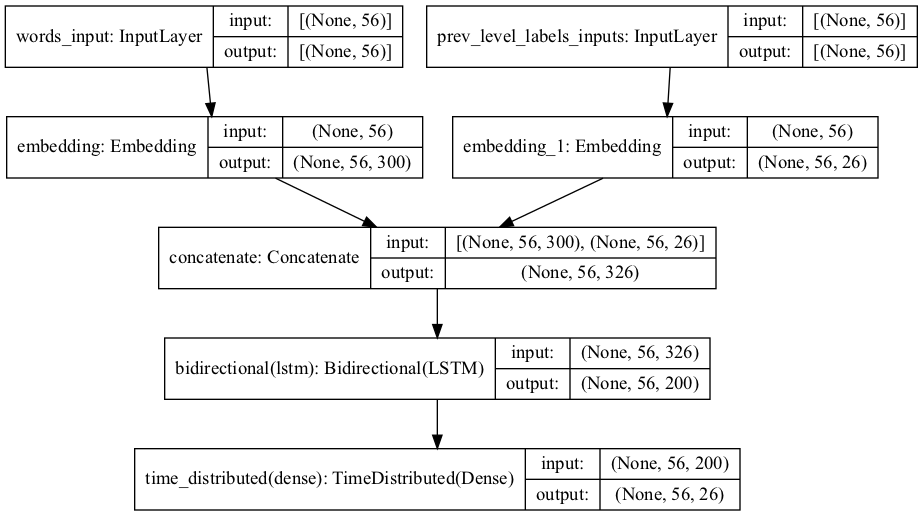

# A Bi-Directional RNN Model for Named-Entity Detection
Named-entity recognition is the task of identifying the segments and classes of named-entities in natural text. Long named-entities may contain mentions of other named-entities embedded within their segments. Detecting such mentions provide better understanding of the underlying text. In the following sections, the parent named-entities and their embedded mentions are referred to as first and second level named-entities respectively.
In this implementation, a bi-directional Recurrent Neural Network (RNN) more specifically a bi-directional Long short-term memory (Bi-LSTM) model is used for the task of detecting first and second level named-entities i.e., nested named-entities in German text.

## The Dataset
This implementation uses the GermEval 2014 NER dataset which consists of 31,000 sentences annotated with 12 main classes as described in [1]. The dataset also includes the annotations of nested named-entities found within the first level named-entities such as (ORG) [[(LOC)California] Institute of Technology]. The dataset is divided into three files: training, development and testing with 24,000, 2,000, and 5,000 sentences respectively.

## Preprocessing the Dataset
Sentences are loaded along with their first level and second level named-entity labels and saved into three lists. These lists will be used to generate the input and output training examples to train the RNN model for both first and second level training phases. In addition to the input and output sequences, unique vocabulary tokens and unique output classes are also extracted and saved into two lists named input_tokens and target_labels respectively. 

## Loading the Embeddings
Pre-trained embeddings which are continuous numerical vector representations of length 300 are used to represent the input words. These embeddings contain syntactic and semantic information about the input words and they can be used as a higher-level alternative to the manual bag-of-words representations of the input. Deepset German word embeddings trained using German Wikipedia sentences and the GloVe approach are used [2].
Since input sequences are of different lengths, a padding token ‘PAD’ is added to each sequence to match the length of the longest sentence in the training dataset. This padding token is also added at the beginning of both input_tokens and target_labels lists. These lists are also augmented with a special token ‘UNKNOWN’ to represent Out of Vocabulary (OOV) tokens when processing the test and development sentences. It is worth mentioning that the development dataset includes a new label “I-ORGderiv” that does not appear in the training dataset. Both input_tokens and target_labels are then sorted and used to build token_index and label_index dictionaries where tokens and labels are associated with unique integer numbers. 
To avoid using all the embeddings available in the Deepset file, a 2D word embedding matrix is constructed where unique vocabulary tokens in the input_tokens list are associated with their corresponding embedding vectors. Both the padding and OOV tokens are given all zeros representations.

## The Model
The used model is a many to many bi-directional LSTM (bi-LSTM) that takes as input a sequence of words of a fixed size and return an equivalent sequence of labels. This architecture allows for better context learning by using both previous and following words in the context to produce accurate predictions. Besides the main bi-LSTM layer, the model also includes an embedding layer and a time distributed dense layer with softmax activation for the output. The number of hidden units of the bi-LSTM layer is set to 100. 

Each input token is represented by two values. The first is the token’s unique integer number i.e., its index in the vocabulary list and the second is the index of the previous level target label. The previous target labels for the first level are all set to ‘O’, whereas the previous targets for the second level (nested named-entities) are set to the output labels of the first level. In the proposed model, both the input and embedding layers are split into two parts each. The first part is to process the input words and the second is to process the previous level labels of the input words. The word embeddings are loaded from the word embedding matrix for each embedding vector, whereas target embeddings are set to one-hot vector representations of the target labels with length 26 each. Figure 1 shows the architecture of the proposed model with a maximum input sequence of length 56 (the longest sentence in the training dataset). 

Figure 1: The architecture of the proposed model.

As figure 1 shows, the bi-LSTM layer produces two outputs for each input sequence i.e., forward and backward outputs. Each output has a length of 100 which is the same as the number of hidden units in the layer. These two outputs are concatenated and passed to the output layer as a single vector of length 200. The output layer will apply softmax activation on its input and produces probability distributions for every token in the input sequences.  

## Training the Model
The model is trained separately for each level named-entities. For the first level, the model is trained using the input sentences in the training dataset and fixed pre-first level label all set to ‘O’. The model is trained on a batch size of length 128 for 15 epochs. For the second level training, the input sentences as well as the output labels of the first level extracted from the training dataset are used as input to train the model. Similar to the first level training, a batch size of 128 is used for the second level training. However, since the model has much less to learn in the second level as the number of nested named-entities is much smaller, 7 epochs were found to be sufficient enough for the second level training. To avoid overfitting, a dropout of 0.2 was used in the training of the bi-LSTM layer for both forward and recurrent states. The model was trained using the Adam optimizer and the categorical cross-entropy loss function. 

## The Results and Possible Improvements
[The GermEval 2014 NER evaluation plan](Evaluation/evaluation.pdf) was used to evaluate the trained model using the test dataset. Table 1 shows the results of all evaluation metrics provided by the evaluation script from the GermEval 2014 Shared Task. For full details [click here](Evaluation/evaluation_test_dataset.txt).

Table 1: The evaluation results of the proposed model using the GermEval 2014 NER evaluation plan metrics.

|   |  Strict, Combined Evaluation (official) |  Loose, Combined Evaluation | Per-Level Evaluation (outer chunks)  | Per-Level Global Evaluation (inner chunks)
| :------------: | :------------: | :------------: | :------------: | :------------:|
|  Accuracy |  97.12% |  97.15% |  94.64% | 99.59% |
| Precision  |  70.23% |  71.24% | 69.88%  |75.49% |
| Recall  |  42.94% |  43.55% |  43.38% |37.67% |
| FB1  |  53.30 | 54.06  |  53.53 |50.26 | |

As shown in Table 1, the accuracy measure is high for all evaluation metrics. This is mainly due to the fact that this measure is calculated on a per-token basis including those labeled with ‘O’. The results also show that the model has high precision when it comes to predicting labels on a per-chunk basis with the highest reaching 75.49% for per-level inner chunks evaluation metric. However, the recall is noticeably lower compared to the precision for all evaluation metrics which lowers the value of FB1 measure. This means that the model misses a lot of correct classifications, however, it accurately classifies those it detects. To improve these results, additional features can be used to represent the input words such as the capitalization, syntactic classes (part of speech) and semantic classes extracted from a knowledge base. The use of a knowledge base can also be further extended to search for pre-defined named-entities and double check the predictions of the model. In addition to improving the input representations, it would be interesting to investigate the effect of adding more LSTM layers on top of the bi-LSTM layer to provide the out dense layer with high level abstract representations of the input sequences. It would also be interesting to investigate other sequence-to-sequence models that adopt attention techniques to signify important parts in the input such as the transformer model. 

## References
- [1] 	D. Benikova, C. Biemann and M. Reznicek, "NoSta-D Named Entity Annotation for German: Guidelines and Dataset," in Proceedings of the Ninth International Conference on Language Resources and Evaluation (LREC'14), 2014, Reykjavik, Iceland. 
- [2] 	[Online]. Available: https://www.deepset.ai/german-word-embeddings. [Accessed 10 11 2021].
